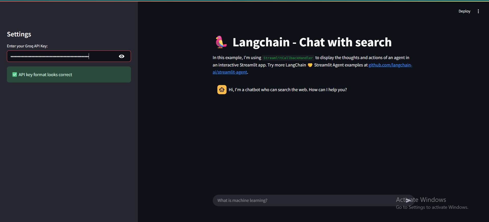
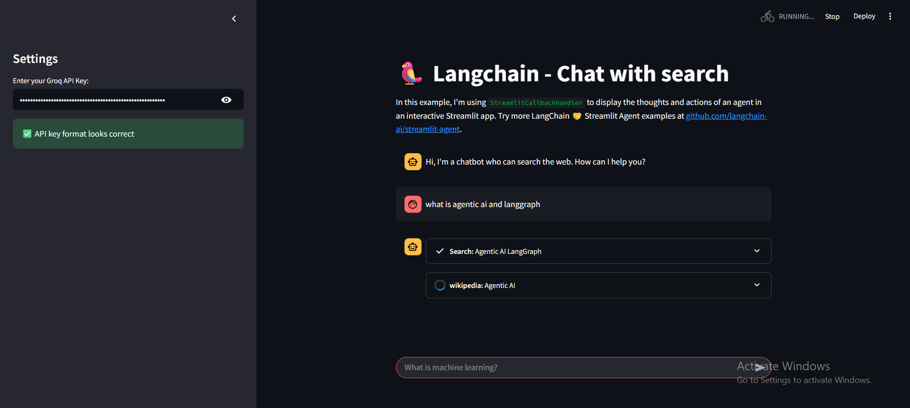

# Chat with Search (Streamlit + LangChain + Groq)

## Overview
Chat with Search is a Streamlit app that answers user questions by intelligently choosing between web search, arXiv, and Wikipedia tools. A LangChain agent (Zero-Shot ReAct) coordinates tools, while a Groq LLM (llama-3.3-70b-versatile) generates the final response. Enter your Groq API key in the sidebar and start asking questions—no extra setup needed.

---

## Screenshots

---

## Features
- Natural-language Q&A with automatic tool selection (web search, arXiv, Wikipedia).
- Visible intermediate steps via Streamlit callback handler.
- Sidebar key entry with quick validation for `GROQ_API_KEY`.
- Simple chat history stored in `st.session_state`.

---

## Tools and Technologies
- **Streamlit** — UI and chat.
- **LangChain** — Agent orchestration & tool calling (Zero-Shot ReAct).
- **Groq** — `langchain_groq` with `llama-3.3-70b-versatile` (streaming).
- **DuckDuckGo** — Web search.
- **arXiv** — Scientific paper lookup.
- **Wikipedia** — Encyclopedic lookup.
- **python-dotenv** — Optional local environment variables.

---

## How It Works
1. User asks a question in the chat.
2. The LangChain agent decides which tool(s) to call (Search, arXiv, Wikipedia).
3. Tool outputs are returned to the agent.
4. The Groq LLM synthesizes a final, user-friendly answer.
5. Intermediate steps are rendered in the UI for transparency.

---

## Configuration
- **Model name**: edit in `app.py` (default: `llama-3.3-70b-versatile`)
- **Agent iterations**: `max_iterations=3`
- **Tools**: enable/disable in `app.py` (DuckDuckGo, arXiv, Wikipedia)
- **API key**: paste `GROQ_API_KEY` in the sidebar (or load from `.env` if you prefer)

---

## Troubleshooting
- **Invalid key**: ensure it starts with `gsk_` and is long enough.
- **Search errors**: the app uses a safe wrapper; any failures are shown as friendly messages.

---

## License
MIT

